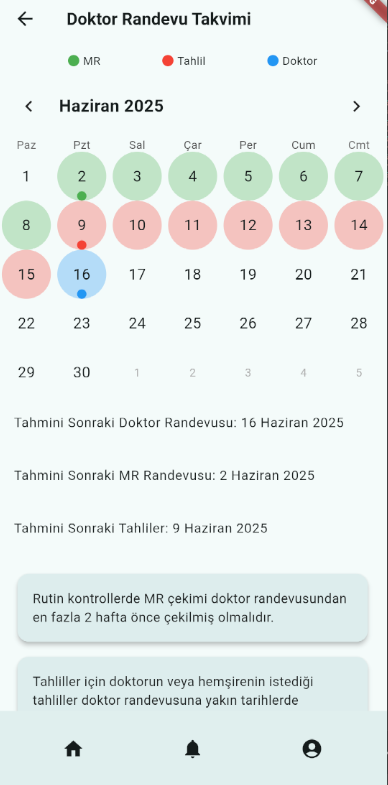

# MS Takip Uygulaması (Multiple Sclerosis Tracker)



Bu uygulama, Multiple Sclerosis (MS) hastalığına sahip bireylerin sonraki randevuların,tahlillerin ve mr randevularının planlanması ve kullanıcıya bunu bilgilendirmek için yapılmıştır.
Kronik hastalıkların randevularının takip edilmesi hem hasta hem de doktor için fayda sağlamalıdır. Bu yüzden hasta doktorun karşısına geldiği zaman tüm tahlillerin mr'ların yapılması planlanlanması
her iki durumda da verimli olacaktır. Doktor randevusundan önce mr ve tahlillerin de planlanması yapılarak kullanıcıya bildirim gidilmesi sağlanmaktadır.
Bu proje TÜBİTAK 2209/A ÜNİVERSİTE ÖĞRENCİLERİ ARAŞTIRMA PROJELERİ DESTEK PROGRAMINDAN KABUL ALMIŞTIR.

## Özellikler:
- Kullanıcı kaydı ve giriş yapma.
- Profil giriş ekranı.
- Geçmiş randevu bildirimleri
- Randevu,tahlil ve mr'ların bulunduğu takvim ekranı
- Firebase tabanlı veri saklama.

  ## Teknolojiler:
- Flutter
- Firebase (Authentication, Firestore)
- Dart
- GitHub Actions (CI/CD)

## Kurulum:

1. Repo'yu kendi bilgisayarınıza klonlayın:
   ```bash
   git clone https://github.com/melishannn/ms_app.git

2.Flutter SDK'yı yükleyin (eğer yüklü değilse): https://docs.flutter.dev/get-started/install

3.Bağımlılıkları yükleyin: flutter pub get
4.Uygulamayı başlatın: flutter run
5.Firebase projenizi yapılandırın ve google-services.json dosyasını projenize ekleyin. 
## Kullanım:
1. Uygulamayı açın ve kullanıcı kaydınızı oluşturun.
2. Profil sekmesinden bilgilerinizi girerek en son doktor randevunuzu belirtin
3. Anasayfadan doktor,tahlil,mr randevu alanından sonraki randevularınızı takip edin
4. Geçmiş randevuların bildirimlerini bildirim sekmesinden takip edin

## İletişim

Eğer projem hakkında sorularınız varsa veya benimle iletişime geçmek isterseniz, aşağıdaki yollarla ulaşabilirsiniz:

- E-posta: [E-mail](mailto:melishankobal1@gmail.com)
- LinkedIn: [LinkedIn Profilim](https://www.linkedin.com/in/melishan-k-11871320a/)


